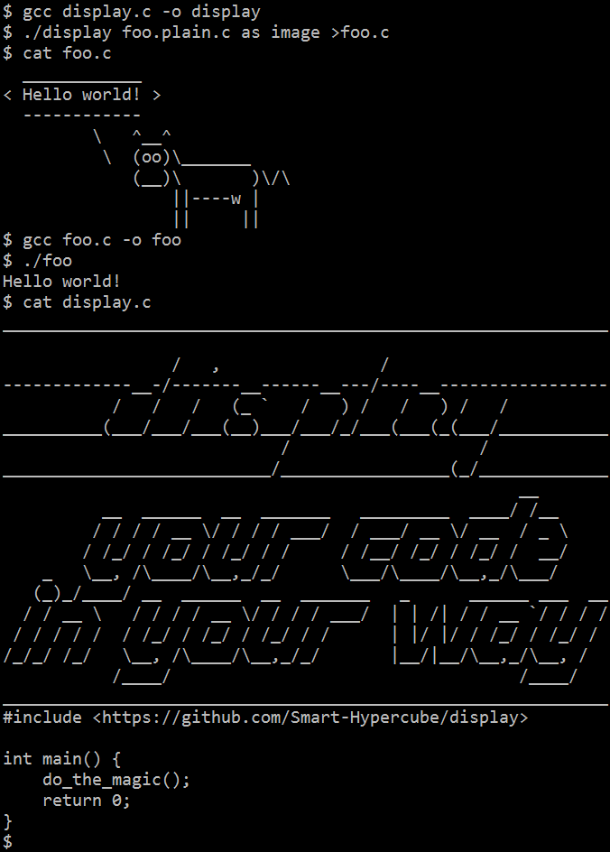

Display your code in your way!
==============================

This tool takes a C file and a text file, and produce a C code file, which has exactly same function as the origin C file, but looks exactly the same as the text file.

`display.c` is not only the source code, but also an example. Just try `gcc display.c` and `cat display.c`.
